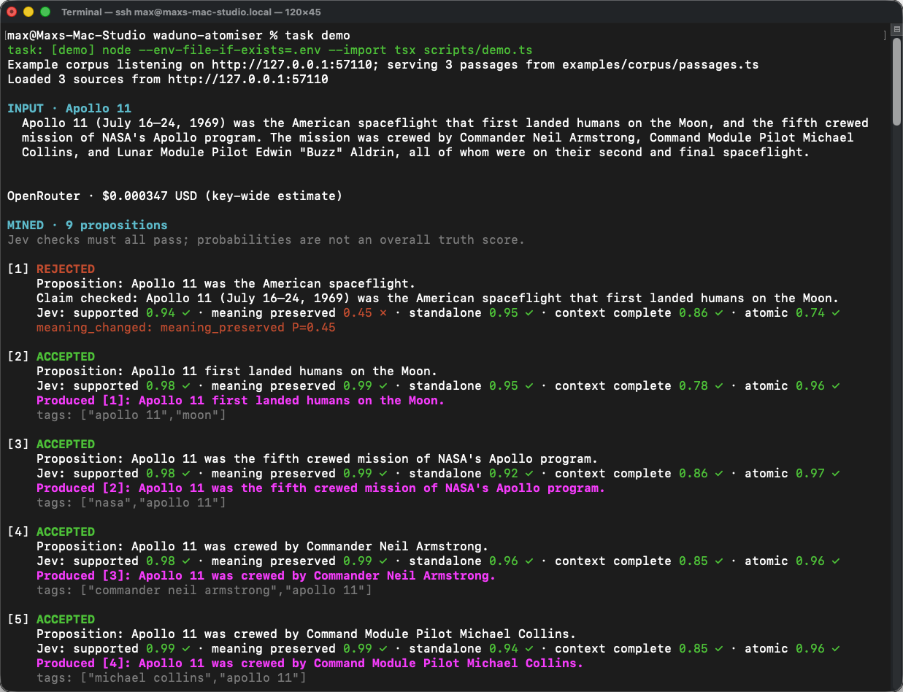

# Atomiser

**Source text in, individual claims out.** Atomiser breaks a passage into small,
standalone claims, checks them against the source, and keeps the evidence with
each accepted result. These are the atoms: claims you can inspect and reuse
without having to reconstruct the paragraph they came from.



## How it works

The pipeline validates the source envelope, then sends its selected text unchanged
to [Gemma-APS]. There is no extra sentence splitter or source-kind filter. Exact
duplicate propositions are removed and the configured LLM canonicalises each proposition
using the source text, title, section path and lead-in.

[Jev] checks five things: is the claim supported by the source, does it preserve
the proposition's meaning, can it stand alone, does it express one claim, and
does it retain the context needed to understand it? **All five must pass.** The
scores are model judgements, not an overall truth score. The current acceptance
gate is `0.6` for each check; standalone sees only the claim.

Eligible failures get a recovery attempt: the LLM repairs incomplete claims;
Gemma-APS splits compound propositions. The results go through the checks again.
Remaining failures are rejected. Jev then classifies the accepted claims' world,
epistemic and temporal context, and Fastino's [GLiNER 2.5] extracts entities. Each atom carries its
claim, source evidence, scores, framing and entities such as
`{ "text": "Neil Armstrong", "type": "individual", "confidence": 0.9988 }`.

Malformed model output, missing classifier answers and failed child operations
fail the run. They are not converted into empty extraction, zero scores or
unchanged claims presented as successful transformations. A valid empty APS
proposition list remains a successful `no_propositions` result.

This is a TypeScript application on Node.js, with Zod contracts and a small
Fastify host exposing `POST /atomise`. [Tandem] runs the pipeline, manages collection
concurrency and records execution in SQLite. The LLM defaults to [GPT-6 Luna] through
OpenRouter but can use a local OpenAI-compatible endpoint. Jev uses OpenRouter;
[GLiNER] runs locally in a Python subprocess kept warm between requests.

## Getting started

Requires Node.js 22+, pnpm, Python 3.13, [Task](https://taskfile.dev), an
OpenAI-compatible Gemma-APS endpoint and an OpenRouter API key. The current Tandem
runtime bundle requires macOS on Apple silicon and the .NET 10 runtime.

```sh
pnpm install
cp .env.example .env
pnpm setup:gliner
```

Configure `.env` using the values in `.env.example`:

| Variable                           | Example / default              | Purpose                                                                 |
| ---------------------------------- | ------------------------------ | ----------------------------------------------------------------------- |
| `APS_BASE_URL`                     | `http://127.0.0.1:8092/v1`     | OpenAI-compatible Gemma-APS endpoint; serve this model separately.      |
| `APS_MODEL`                        | `gemma-7b-aps-it-8bit`         | Model name exposed by your APS server.                                  |
| `APS_API_KEY`                      | Optional                       | Leave blank for an unauthenticated APS endpoint.                        |
| `OPENROUTER_API_KEY`               | Required                       | OpenRouter API key for Jev, also used by the default LLM configuration. |
| `LLM_BASE_URL`                     | `https://openrouter.ai/api/v1` | OpenAI-compatible endpoint for canonicalisation and repair.             |
| `LLM_MODEL`                        | `openai/gpt-6-luna`            | Shared LLM for canonicalisation and repair, including split children.   |
| `LLM_API_KEY_ENVIRONMENT_VARIABLE` | `OPENROUTER_API_KEY`           | Name of the environment variable containing the LLM endpoint's key.     |
| `LLM_REQUEST_TIMEOUT_MILLISECONDS` | `120000`                       | LLM request timeout in milliseconds.                                    |
| `ATOMIZER_RECOVERY`                | `true`                         | Enable repair and splitting; the demo always enables recovery.          |
| `ATOMISER_HOST`                    | `127.0.0.1`                    | Atomiser HTTP host bind address.                                        |
| `ATOMISER_PORT`                    | `8099`                         | Atomiser HTTP port.                                                     |
| `ATOMISER_CONCURRENCY`             | `2`                            | Maximum active HTTP source runs.                                        |
| `ATOMISER_TIMEOUT_MS`              | `600000`                       | Timeout per HTTP source run, in milliseconds.                           |
| `CORPUS_BASE_URL`                  | `http://127.0.0.1:8098`        | Local example corpus API address used by the demo.                      |
| `TANDEM_LEDGER_PATH`               | `.data/atomize.sqlite3`        | SQLite execution ledger path.                                           |
| `GLINER_PYTHON`                    | `.venv/bin/python`             | Python interpreter installed by `pnpm setup:gliner`.                    |
| `GLINER_MODEL_PATH`                | `.data/gliner2.5-base-v1`      | Local weights downloaded once by `pnpm setup:gliner`.                   |

```sh
task demo
```

Abbreviated demo output — only the examples producing atoms 1 and 7 are shown.
Their original proposition numbers are 1 and 8. The first two sources and the
intervening results are omitted; counts and costs are from the full run. This
transcript predates the entity output revision; entity results are omitted below.

```text
max@Maxs-Mac-Studio waduno-atomiser % task demo
task: [demo] node --env-file-if-exists=.env --import tsx scripts/demo.ts
Example corpus listening on http://127.0.0.1:57110; serving 3 passages from examples/corpus/passages.ts
Loaded 3 sources from http://127.0.0.1:57110

[... Apollo 11 and 1992 Monaco Grand Prix output omitted ...]

INPUT · Marge vs. the Monorail
  When the Environmental Protection Agency fines Mr. Burns $3 million for dumping nuclear
  waste in a Springfield park, a town meeting is held to decide how to spend the money.
  Marge nearly persuades the townspeople to repair Springfield's heavily damaged Main
  Street, but fast-talking salesman Lyle Lanley leads a song-and-dance routine that
  convinces them to build a monorail.

MINED · 8 propositions
Jev checks must all pass; probabilities are not an overall truth score.

[1] ACCEPTED
    Proposition: The Environmental Protection Agency fines Mr. Burns $3 million.
    Claim checked: The Environmental Protection Agency fines Mr. Burns $3 million for
    dumping nuclear waste in a Springfield park.
    Jev: supported 0.98 ✓ · meaning preserved 0.70 ✓ · standalone 0.92 ✓ ·
    context complete 0.84 ✓ · atomic 0.89 ✓
    Produced [1]: The Environmental Protection Agency fines Mr. Burns $3 million for
    dumping nuclear waste in a Springfield park.

[... propositions 2–7 and their recovery results omitted ...]

[8] ACCEPTED
    Proposition: The song-and-dance routine convinces them to build a monorail.
    Claim checked: Lyle Lanley's song-and-dance routine convinces the townspeople
    to build a monorail.
    Jev: supported 0.96 ✓ · meaning preserved 0.94 ✓ · standalone 0.90 ✓ ·
    context complete 0.76 ✓ · atomic 0.91 ✓
    Produced [7]: Lyle Lanley's song-and-dance routine convinces the townspeople
    to build a monorail.

OUTPUT · 7 atoms · completed
  1. The Environmental Protection Agency fines Mr. Burns $3 million for dumping
     nuclear waste in a Springfield park.
  [... atoms 2–6 omitted ...]
  7. Lyle Lanley's song-and-dance routine convinces the townspeople to build a monorail.

Atoms saved to: /Users/max/Sites/waduno-group/waduno-atomiser/.data/demo/2026-09-22T15-31-44.195Z-gqeyQ5/atoms.json
Report saved to: /Users/max/Sites/waduno-group/waduno-atomiser/.data/demo/2026-09-22T15-31-44.195Z-gqeyQ5/report.json

OpenRouter demo total · $0.003696 USD (key-wide estimate)
```

The demo owns a watched example corpus process, fetches Wikipedia excerpts over
HTTP and runs each through the pipeline with recovery enabled. It prints the
decisions and saves atoms and reports under `.data/demo/`. Its example process
stops when the demo finishes or is interrupted. An occupied corpus port fails
startup; the demo never kills or silently reuses another process.

Add `{ id, title, text }` entries to `examples/corpus/passages.ts` to try your own
text. `task example-corpus` runs the watched API independently in the foreground;
stop it with Ctrl-C before running the demo on the same port. Use `pnpm serve` to
start the atomiser HTTP host. Example excerpt attribution is in
[SOURCES.md](examples/corpus/SOURCES.md).

## Licence

The code is licensed under the [MIT License](LICENSE), copyright 2026 Max Anstey.
Third-party dependencies and model weights retain their respective licences.
The Wikipedia excerpts retain their CC BY-SA 4.0 licence; see
[example attribution](examples/corpus/SOURCES.md).

[Gemma-APS]: https://huggingface.co/google/gemma-7b-aps-it
[GPT-6 Luna]: https://openrouter.ai/openai/gpt-6-luna
[Jev]: https://openrouter.ai/typesafe/jev-1.13
[GLiNER]: https://github.com/fastino-ai/GLiNER2
[GLiNER 2.5]: https://huggingface.co/fastino/gliner2.5-base-v1
[Tandem]: https://github.com/maxanstey-meridian/tandem
